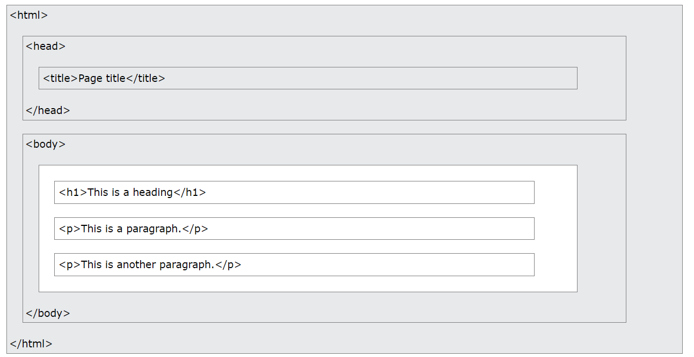
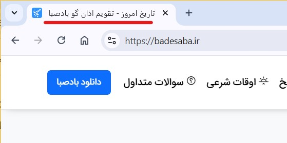

طراحی صفحات وب به کمک HTML 5
==================================

HTML چیست؟
-----------

HTML یک زبان نشانه‌گذاری برای صفحات وب است. HTML مخفف HyperText Markup Language، به معنی زبان نشانه‌گذاری ابرمتن است. HTML یک زبان برنامه‌نویسی نیست؛ بلکه یک زبان نشانه‌گذاری است. به این معنی که به کمک این زبان می‌توان بخش‌های مختلف یک متن را نشانه‌گذاری کرده و نحوه‌ی نمایش هر بخش را در مرورگر تعیین کرد. کدهای HTML توسط مرورگر تفسیر شده و به صورت تصویری نمایش داده می‌شوند.

ساختار صفحات HTML
-------------------

هر عنصر در HTML با برچسب (tag) مشخص می‌شود. برخی عناصر برچسب شروع و پایان دارند و برخی عناصر تک برچسبه بوده و تنها یک برچسب دارند. ساختار عناصر در HTML به شکل زیر است:

.. code-block:: html

    <tag_name>Contents</tag_name>

عناصر در HTML ساختار درختی و تودرتو دارند. یعنی هر عنصر می‌تواند شامل چند عنصر دیگر باشد که هر عنصر هم می‌تواند شامل عناصر دیگری باشد. به عنصر درونی فرزند و به عنصر بیرونی والد می‌گویند.

    
فرمت فایل‌های صفحات وب .html است که برای ساخت این فایل‌ها از هر ویرایشگر متنی می‌توان استفاده کرد. ویرایشگرهای متنی ساده مثل Notepad ویندوز و ویرایشگرهای پیشرفته‌تر مانند Visual Studio Code.

ساخت یک سند HTML
-----------------
اولین عنصری که باید در یک صفحه وب نوشته شود تعریف یا اعلان سند است: <!DOCTYPE html>

پس از این عنصر باید عنصر html را در صفحه قرار دهیم. تمام سایر عناصر باید درون این عنصر قرار گیرند.

دو فرزند اصلی عنصر html که معمولا در تمام صفحات وب وجود دارند، عناصر head و body هستند. درون عنصر head اطلاعاتی مربوط آن صفحه نوشته می‌شود و درون عنصر body تمام محتویاتی که باید در صفحه نمایش داده شود قرار داده می‌شود. بنابراین کد html یک صفحه ساده وب به شکل زیر است:

.. code-block:: html

    <!DOCTYPE html>
    <html>
        <head>
            اطلاعات مربوط به صفحه
        </head>
        <body>
            تمام مطالب موجود در صفحه
        </body>
    </html>

آشنایی با چند عنصر ابتدایی
------------------------------

پاراگراف
^^^^^^^^^^^^^^^

یکی از ساده‌ترین عناصر در html عنصر پاراگراف است که با p نمایش داده می‌شود. محتوای درون این عنصر باید شامل یک پاراگراف متن باشد.

عنوان‌ها (headings)
^^^^^^^^^^^^^^^^^^^^^

برچسب‌های h1 تا h6 برای نشانه‌گذاری عنوان در نظر گرفته شده‌اند. تیترهای مطلب اصلی که درون چندین پارگراف نوشته شده‌اند، بسته به سطح تیتر درون یکی از این عناصر قرار می‌گیرند. ممکن است در یک متن هر تعداد h1، هر تعداد h2، و ... تا هر تعداد h6 داشته باشیم یا تنها از یک یا دو سطح از این عناصر استفاده شود و یا هیچ عنوانی در متن نداشته باشیم.

.. note::
    html یک زبان نشانه‌گذاری است که در آن بر روی معنا تأکید زیادی شده است. یعنی برای هر بخش مشخص از متن یک عنصر در نظر گرفته شده است. از این رو سعی کنید هر چیزی که در صفحه وب خود ایجاد می‌کنید درون یک عنصر مرتبط قرار داشته باشد تا مرورگر وب، صفحه‌خوان‌ها، و نرم‌افزارهایی که محتوای صفحه را تحلیل می‌کنند، بتوانند درک درستی از متن و محتوای شما داشته باشند. به طور مثال عنوان متن را درون عنصر p قرار ندهید؛ بلکه از یکی از عناصر h استفاده کنید.

عنوان صفحه (title)
^^^^^^^^^^^^^^^^^^^^^^^^

این عنصر که درون عنصر head نوشته می‌شود، عنوان پنجره‌ی مرورگر را تعیین می‌کند.

ویژگی‌ها (Attributes)
-----------------------

ویژگی‌ها اطلاعاتی هستند که به یک عنصر اضافه می‌شوند. هر عنصر می‌تواند چندین ویژگی داشته باشد. ویژگی‌ها در برچسب شروع و به شکل زیر نوشته می‌شوند::
    
    مقدار ویژگی = نام ویژگی

برخی عناصر برای این که به درستی کار کنند نیاز دارند تا برخی از ویژگی‌های آن‌ها تنظیم شود. مانند عنصر a و img. در ادامه تعدادی از مثال های کاربردی برای ویژگی ها یا Attribute ها را با هم مشاهده خواهیم کرد.

عنصر a
-------

این عنصر برای پیوند دادن صفحات وب به یکدیگر به کار می‌رود. هر چیزی که درون این عنصر نوشته شود، به لینک تبدیل می‌شود. ویژگی ضروری این عنصر، مقصد یا href است. مثال:

.. code-block:: html

    <a href="./2.html">برو به صفحه دوم</a>

عنصر img یا تصویر
-----------------------

این عنصر برای درج تصویر به کار می‌رود. ویژگی ضروری این عنصر آدرس تصویر یا src است. برچسب img تک برچسبه است و برچسب پایان ندارد. مثال:

.. code-block:: html

    
